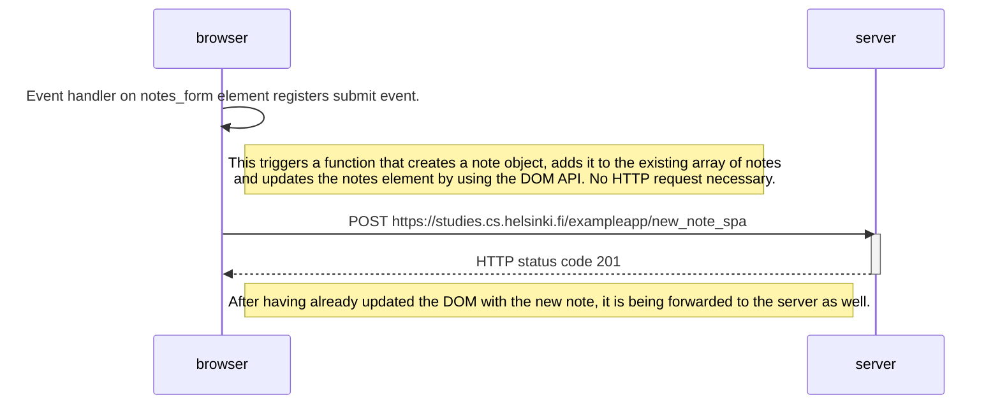

# Exercise 0.6 - SPA New Note Sequence Diagram

Here, the true difference of the SPA approach can be seen. Only one request to the server had to be made.

```mermaid
sequenceDiagram
    participant browser
    participant server

    browser->>browser: Event handler on notes_form element registers submit event.

    Note right of browser: This triggers a function that creates a note object, adds it to the existing array of notes <br>and updates the notes element by using the DOM API. No HTTP request necessary.

    browser->>server: POST https://studies.cs.helsinki.fi/exampleapp/new_note_spa
    activate server
    server-->>browser: HTTP status code 201
    deactivate server

    Note right of browser: After having already updated the DOM with the new note, it is being forwarded to the server as well.

```
